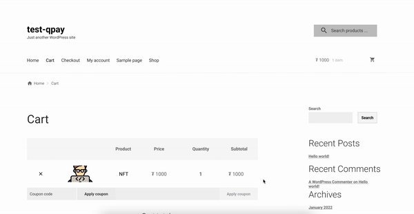

# Gateway for Qpay on WooCommerce (^_^)

> WordPress plugin for `WooCommerce - Payment Gateway` using [QPay](https://qpay.mn/)

- We wanted to enable shops that are built on WordPress to pay easily
- However there were no readily available WordPress plugin for Mongolian banking gateways or QPay
  - Some were unreliable (NO official maintenance or downloadable from marketplace), some were too pricey (100k monthly)
- Thats why we decided to build one ourselves and make it free to use for everyone

## Getting Started

- Install [LocalWP](https://localwp.com/) on your machine
  - Create new site
- Install [WooCommerce](https://woocommerce.com/) plugin & configure
  - Create product
- Install `Gateway for Qpay on WooCommerce` zip file
- Buy product

## Running the tests

**TODO: ** Explain how to run the automated tests for this system

## Deployment

**TODO: ** Add additional notes about how to deploy this on a live system

## Built With

* [PHP](https://www.php.net/) - PHP is a popular general-purpose scripting language that is especially suited to web development.

## Contributing

Please read [CONTRIBUTING.md](CONTRIBUTING.md) for details on our code of conduct, and the process for submitting pull requests to us.

## Versioning

We use [SemVer](http://semver.org/) for versioning. For the versions available, see the [tags on this repository](https://github.com/biligunb/qplugin/tags). 

## Authors

* **Bilguun** - *Initial work* - [biligunb](https://github.com/biligunb)
* **Bayarmunkh** - *Initial work* - [bayarmunkhD](https://github.com/bayarmunkhD)
* **Boldbaatar** - *Initial work* - [BoldbaatarG](https://github.com/BoldbaatarG)
* **Khishigdorj** - *Initial work* - [ekhishigee](https://github.com/ekhishigee)
* **Munkherdene** - *Initial work* - [moogiikat](https://github.com/moogiikat)

See also the list of [contributors](https://github.com/biligunb/qplugin/contributors) who participated in this project.

## License

This project is licensed under the MIT License - see the [LICENSE](LICENSE) file for details

## Acknowledgments

* Kudos to [Unimedia Solutions LLC](https://unimedia.mn/) - 2020 Innovator team members Munkhtur & Bilguun, whose code we used as an example
